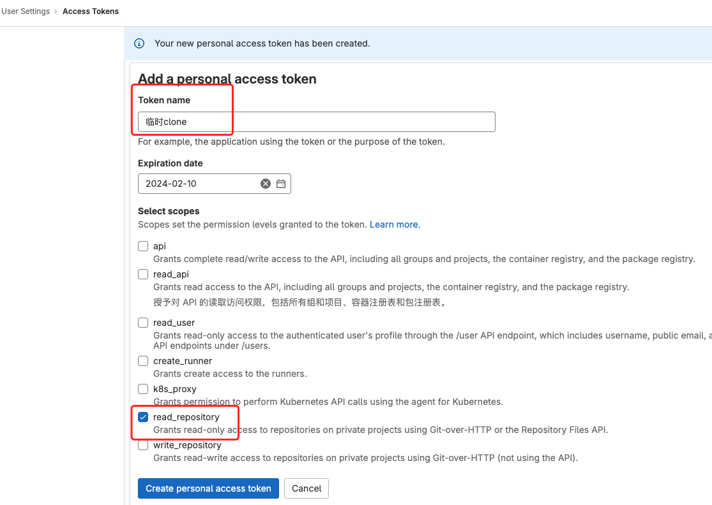
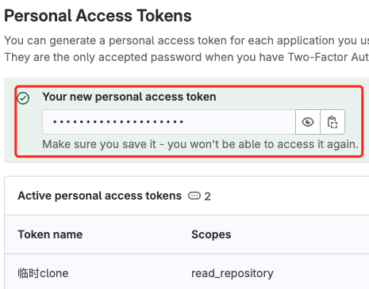

# 记录几个GitLab使用技巧


> 假设我有一个项目，名为：sample-project，拉取地址为：https://gitlab.com/gitlab-tests/sample-project.git


## 1. 通过 username + password 拉取代码

在实际工作中，我经常需要在某个新的环境中调试项目，拉取临时地项目代码。添加新的ssh key，用完还得删除，显得太麻烦。实际上，我们可以通过`username + password`来单次验证并拉取所需代码。可以使用以下几种命令：

- 第1种，携带用户名，密码在后续输入

  ```bash
  $ git clone https://<username>@gitlab.com/gitlab-tests/sample-project.git

  Cloning into 'sample-project'...
  Password for 'https://<username>@gitlab.com': # 输入密码
  ```
- 第2种，携带用户名和密码，直接拉取

  ```bash
  $ git clone https://<username>:<password><p@gitlab.com/gitlab-tests/sample-project.git

  Cloning into 'sample-project'...
  remote: Enumerating objects: 12, done.
  remote: Total 12 (delta 0), reused 0 (delta 0), pack-reused 12
  Receiving objects: 100% (12/12), 30.73 KiB | 30.73 MiB/s, done.
  Resolving deltas: 100% (1/1), done.
  ```

## 2. 通过 username + token 拉取代码

如果账号启用了**双重身份认证（2FA）**，密码就不能使用了，需要用token来代替密码。

- 首先，需要生成一个token（[官方教程](https://docs.gitlab.com/ee/user/profile/personal_access_tokens.html#create-a-personal-access-token)）。取一个合适的名字，配置`read_repository`（仓库读取）权限，如下图：

  
- 生成后，请复制保存好你的token，因为之后就看不到这个token的明文了

  

- 有了token就可以像上面一样拉取代码了
  ```bash
  $ git clone https://<username>:<token><p@gitlab.com/gitlab-tests/sample-project.git

  Cloning into 'sample-project'...
  remote: Enumerating objects: 12, done.
  remote: Total 12 (delta 0), reused 0 (delta 0), pack-reused 12
  Receiving objects: 100% (12/12), 30.73 KiB | 30.73 MiB/s, done.
  Resolving deltas: 100% (1/1), done.
  ```
## 3. 直接拉取指定的分支/Tag

临时拉取某个项目进行调试时，往往不是默认分支，可能是某个版本开发分支/Tag。这种情况下，可以在拉取时直接指定到这个分支/Tag。

- 假设仓库有个分支，名为：feature-v1.2.0，可以这样拉取：
  ```bash
  $ git clone -b feature-v1.2.0 https://<username>:<password><p@gitlab.com/gitlab-tests/sample-project.git

  Cloning into 'sample-project'...
  remote: Enumerating objects: 12, done.
  remote: Total 12 (delta 0), reused 0 (delta 0), pack-reused 12
  Receiving objects: 100% (12/12), 30.73 KiB | 30.73 MiB/s, done.
  Resolving deltas: 100% (1/1), done.
  ```

- 假设仓库有个Tag，名为：v1.1.0，可以这样拉取：
  ```bash
  $ git clone -b v1.1.0 https://<username>:<password><p@gitlab.com/gitlab-tests/sample-project.git

  Cloning into 'sample-project'...
  remote: Enumerating objects: 12, done.
  remote: Total 12 (delta 0), reused 0 (delta 0), pack-reused 12
  Receiving objects: 100% (12/12), 30.73 KiB | 30.73 MiB/s, done.
  Resolving deltas: 100% (1/1), done.
  Note: switching to 'xxxx'. # Tag hash

  You are in 'detached HEAD' state. You can look around, make experimental
  changes and commit them, and you can discard any commits you make in this
  state without impacting any branches by switching back to a branch.

  If you want to create a new branch to retain commits you create, you may
  do so (now or later) by using -c with the switch command. Example:

    git switch -c <new-branch-name>

  Or undo this operation with:

    git switch -

  Turn off this advice by setting config variable advice.detachedHead to false
  ```

## 参考资料

- [GitLab官方文档 - Clone using a token](https://docs.gitlab.com/ee/gitlab-basics/start-using-git.html#clone-using-a-token)  
- [GitLab官方文档 - Create a personal access token](https://docs.gitlab.com/ee/user/profile/personal_access_tokens.html#create-a-personal-access-token)
- [Git官方文档 - GIT URLS](https://git-scm.com/docs/git-clone#_git_urls)
- [Stackoverflow - How do I provide a username and password when running "git clone git@remote.git"?](https://stackoverflow.com/questions/10054318/how-do-i-provide-a-username-and-password-when-running-git-clone-gitremote-git)